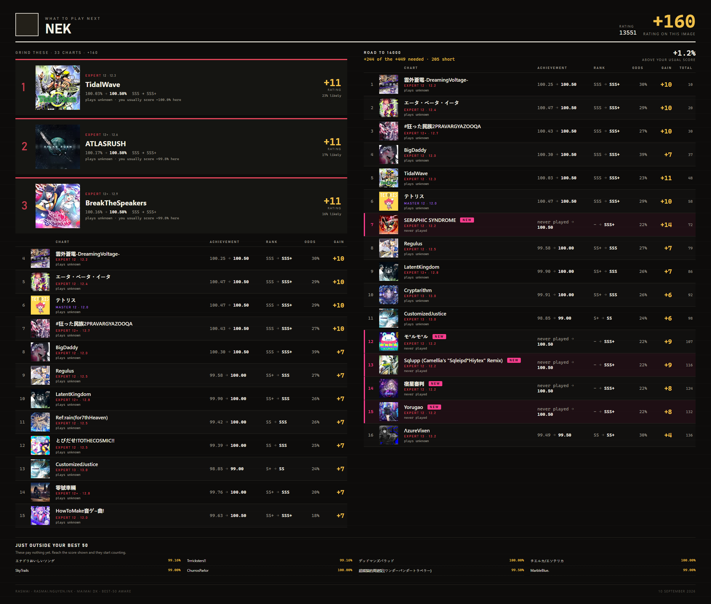
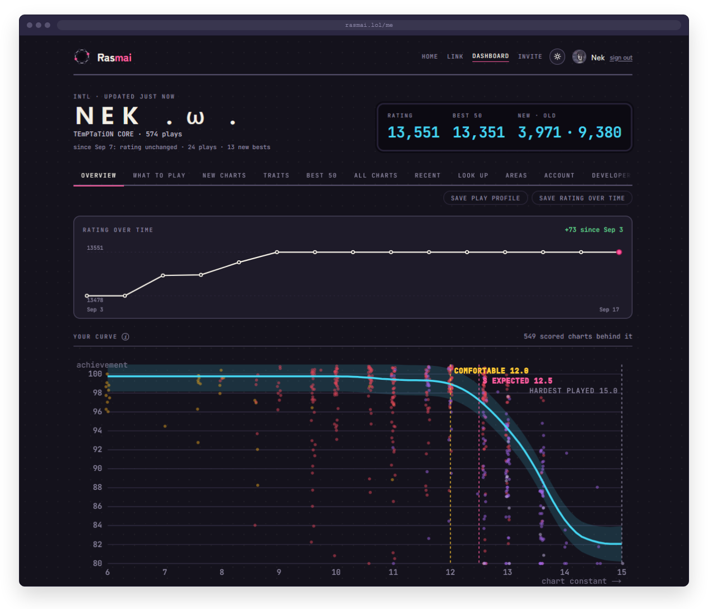
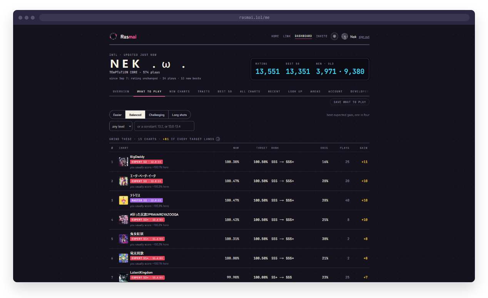
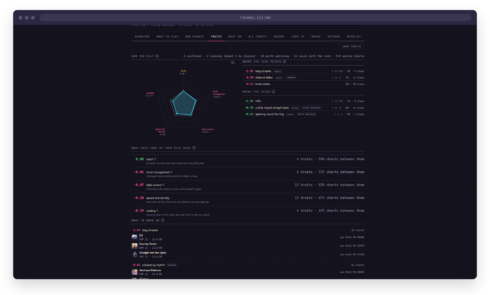
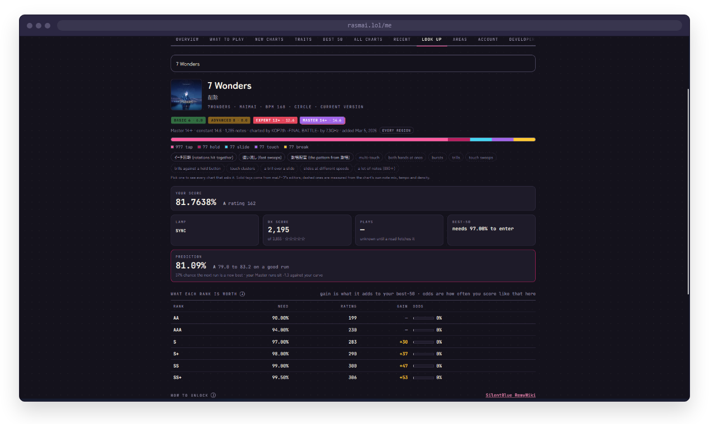

# Rasmai

Discord bot for maimai DX. It reads your scores from maimai DX NET and tells you what to play for the most rating, based on how you actually play. Comes with a web dashboard at [rasmai.nguyen.ink](https://rasmai.nguyen.ink).

## What it looks like

`/analyze` answers with a poster: what to grind, the route to the next thousand, and what sits just outside your best 50.



The dashboard has the same analysis with every tab the bot's commands cover.

| | |
|---|---|
|  |  |
|  |  |

## Commands

- `/login` link your maimai account, takes about a minute
- `/analyze [challenge] [level]` what to grind right now and the route to the next thousand; when your best 50 is nearly maxed and the grind list runs short it keeps going with charts you have never played, either because a good first run would bank rating or because they drill a pattern that costs you points; `level` holds the picks to a level like `13+`, a constant like `13.2`, or a range like `13.0-13.4`
- `/plan [target] [difficulty] [min_level]` full route to a rating target
- `/session [credits]` where to spend tonight's credits
- `/new [difficulty] [level] [focus]` unplayed charts around your level
- `/b50` or `/top` the 50 charts that make your rating
- `/chart <title> [difficulty]` your score, the prediction, what each rank is worth, what the chart asks of you, unlock info, video; a Song button opens the whole song
- `/charts [pattern] [level] [difficulty]` browse by pattern tag (streams, hand swaps, slow rotations, in Japanese or English) or by level, your scores beside each chart
- `/random [level] [difficulty] [unplayed]` pick something
- `/profile` how you play and how well the model predicts you; the Traits button shows what your own scores confirm
- `/progress` rating over time and when the next thousand lands
- `/recent [play]`, `/dxscore`, `/area`, `/compare @user`, `/leaderboard`
- `/refresh` force a full read, `/settings`, `/export [json|csv]`, `/logout` (deletes everything stored about you)
- `/server` (Manage Server) turn `/leaderboard` off or on for a server

Works in servers, DMs and group DMs, and as a user install so the commands follow you anywhere. Turn on both install contexts in the Developer Portal (`bot` + `applications.commands` for guilds, `applications.commands` for users).

## How it picks charts

Every pick is scored by the rating you'd actually gain after your best 50 is recounted, at a target you land about one time in four. Targets come from your own accuracy curve, play counts and score history, and never ask for a rank you haven't shown at that level. `challenge` shifts them: easier lands about half the time, balanced one in four, challenging one in six, and long shots one in ten for the biggest gain on the board.

A few things the model does that most trackers don't:

- A best that was itself a dropped run, one or two plays that ended far under what you score at that level, is not read as the chart's difficulty for you. The chart is offered again at what a first pass would land, priced as a first pass, and the pick says so. A chart ground many times to the same low score is genuinely that hard for you, which is one more thing the play counts are for.
- The odds are the chance of **one** run landing the target, measured from how far your score moves between repeat plays of the same chart. How much charts differ from each other is a separate, much larger number, and using it here made every rank look reachable. A chart you have played once carries more uncertainty than one you have ground, and play counts sharpen it
- Expert and Master 13s are scored separately, since the same constant doesn't land the same on both
- The curve is capped at what you've actually scored at your hardest level, so it can't promise a 13+ score off your 12+ results. New-chart searches reach up from your hardest S, not from the hardest chart you ever attempted, so one failed 15 doesn't get a 12,000 player offered 15s
- Every recorded play is checked against the prediction made before it. With 15+ plays the model corrects its own spread and centre. `/profile` shows how well it's been predicting you
- Chart traits (streams, jacks, slides, tempo changes, note mix) come from [maiノーツ](https://mai-notes.com). Every tag is fitted together over your bests and every recorded play, with play count and difficulty held fixed, and a trait is only named once it beats what shuffled tags produce and keeps its sign in both halves of your own charts. Most players will see few confirmed traits at first; more plays sharpen it. The Traits view also shows the groups that lean one way but have not passed yet, marked as such, names charts in your own band to practise each weak pattern on, and lists the groups you play no differently from the rest. Only the confirmed ones feed `/new focus:` and the picks. Pattern tags are also a reading aid on their own: `/chart` lists what a chart asks of you and `/charts pattern:` finds every chart that asks it, so you can practice a pattern on purpose. maiノーツ has tagged about one chart in ten, nearly all Master and above, so every chart also carries what its own numbers say: note mix, tempo band and density, marked as measured rather than written by an editor

It only reads maimai DX NET when something changed. A command signs in, checks the profile and recent plays (a few seconds), and rebuilds from the stored copy unless a new play, play count or rating shows up. A full read happens when it does, when the stored copy is a week old, or on `/refresh`. A read that meets a song the chart database doesn't know fetches the database again on the spot, so a new song gets its constants the first time you play it. Link your account and the first read starts in the background. `/settings history:true` reads your recent plays once a day so nothing falls off the 50-play list between commands, and `notify:true` DMs you what it found: new bests and a moved rating. Commands answer from the stored copy during maintenance instead of failing, and `/analyze` opens with what moved since your last read.

English titles and romaji come from [SilentBlue RemyWiki](https://silentblue.remywiki.com/), along with chart videos, unlock notes and area names. Search accepts either language: "telepathy" finds テレパシ.

## Dashboard

`/me/` on the site has everything the bot has read: rating over time, best 50, every scored chart with filters, full play history, what to play at each target, new charts, traits, area travel, and a look up tab that shows any chart the way `/chart` does. Sign in is Discord (`identify` only). It's a home screen app too: add from Safari's share sheet on iOS, or Chrome's install prompt on Android. Light/dark switch in the header, saved in the browser.

## Running it

```bash
python -m venv .venv
.venv\Scripts\activate          # Windows
pip install -r requirements.txt
playwright install chromium
copy .env.example .env          # fill in DISCORD_TOKEN
python -m rasmai
```

The site is a Next.js app in `web/`, run as its own server:

```bash
cd web
npm ci
npm run dev                     # http://localhost:3000, set MAIMAI_PUBLIC_URL to match in .env
```

The bot keeps an internal JSON API on `127.0.0.1:8765` that the site calls with `RASMAI_INTERNAL_SECRET`. Nothing in the bot process listens to the internet.

### Developing

`dev.py` does the steps above for you and runs both halves with reloading:

```bash
python dev.py setup             # .venv, pip and npm installs, Chromium, a starter .env
python dev.py run               # bot + site together; --bot-only / --web-only for one half
python dev.py check             # the verification sweep CI runs, plus the site's type-check
python dev.py sample export.json   # run a /export file through the model without a Discord account
```

Put your `DISCORD_TOKEN` in `.env` after `setup`; for the site's sign-in you also need `DISCORD_CLIENT_ID` and `DISCORD_CLIENT_SECRET` from the Developer Portal with `http://localhost:3000/auth/callback` as a redirect. `MAIMAI_GUILD_ID` set to your server makes new slash commands appear there at once instead of after Discord's global delay. Edits to the site reload in the browser; the bot is restarted by hand (`python dev.py bot`).

### Docker

Two containers from one Dockerfile, `bot` and `web`. Only the site is published, on `127.0.0.1:8765` of the host. Put your https in front of it (Cloudflare tunnel, Caddy, nginx).

```bash
cp .env.example .env            # DISCORD_TOKEN, MAIMAI_PUBLIC_URL, RASMAI_INTERNAL_SECRET
docker compose up -d --build
```

Pushes to `main` build `ghcr.io/ne-k/rasmai` and `ghcr.io/ne-k/rasmai-web`, so on the server it's just:

```bash
docker compose pull && docker compose up -d
```

`./data` (accounts, scores, history) and `./otoge_cache` (chart database and jackets) persist across rebuilds.

## Configuration

Everything is in `.env`, see `.env.example` for the full list. The ones that matter:

| Variable | What it does |
|---|---|
| `DISCORD_TOKEN` | Bot token. Required. |
| `MAIMAI_PUBLIC_URL` | The https address people reach the site at. |
| `MAIMAI_TUNNEL` | `quick`, or the name of a Cloudflare tunnel. |
| `RASMAI_INTERNAL_SECRET` | Shared secret between the site and the bot. Any long random string. |
| `RASMAI_SESSION_SECRET` | Signs the dashboard's session cookies. |
| `DISCORD_CLIENT_ID` / `DISCORD_CLIENT_SECRET` | Dashboard sign-in. Add `<MAIMAI_PUBLIC_URL>/auth/callback` as a redirect in the portal. |
| `CF_KEY` / `CF_SECRET` | Cloudflare Turnstile on both sign-ins. Off when empty. |
| `MAIMAI_GUILD_ID` | Your server id, so new commands show up instantly instead of in an hour. |
| `DISCORD_BOT_INVITE` | The install link `/invite` sends people to. |
| `MAIMAI_SNAPSHOT_MAX_AGE_HOURS` | How long a stored read is reused before a full read. Default 168. |
| `MAIMAI_RECHECK_MINUTES` | How old an in-memory analysis gets before a command checks the site again. Default 3. |
| `MAIMAI_MAX_CONCURRENT` | Score reads at once. Default 24. |
| `MAIMAI_EMOJI` / `MAIMAI_PRESENCE` | Emoji pack upload, status tracking maintenance. Both on by default. |
| `USER_AGENT` | How the bot names itself to the wikis and chart databases. Empty is `rasmai/1.0 (+MAIMAI_PUBLIC_URL)`; adding a contact address is the polite thing. |
| `MAIMAI_DEBUG` / `MAIMAI_DEBUG_EXPORT_JSON` | Verbose scraper logs and per-analysis JSON dumps. Leave off on a public bot. |

## What's stored

All local, in `data/`:

- linked accounts: Discord id, region, and the maimai session cookie (not a password), encrypted
- your scores, play history, rating history, area readings and play counts
- your `/settings`, including the compare and leaderboard opt-ins (off by default)

`/logout` deletes all of it. Nothing is sent anywhere except SEGA's site. Privacy policy and terms are at `/privacy/` and `/terms/`.

## Code layout

```
rasmai/
  bot/          commands, builders (one per reply), ui, tasks, state
  engine/       the model: skill curve, traits, area pace
  images/       rendered posters and cards
  scraping/     maimai DX NET, otoge-db, the wiki, mai-notes
  storage/      SQLite
  web/          the internal API the site calls
web/            the Next.js site
brand/          avatar, icons, emoji pack 
dev.py          set up and run both halves
```

## Special thanks

- [tomomai](https://github.com/shedaniel/tomomai) by shedaniel, whose login flow is the one `/login` uses to link a maimai account.
- [otoge-db](https://github.com/zvuc/otoge-db) by zvuc, the chart database every constant and jacket here comes from.
